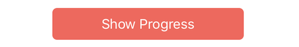

# swift-custom-ui-elements
Custom UI elements written for convenience

The following components are to be developed in UI for swift

* Rounded and corner type button
* Progress view circle
* Custom progress view bar
* Range selection slider 
* Toast message UI
* Custom collection views
	* Vertical
	* Circular
	* Spiral
* UIImage with circular and squared
* Radiant background view

To integrate swift-custom-ui-elements into your Xcode project manually
add InnoUI module to your project.

```swift
import InnoUI
```

### Rounded and corner type button 
#### Description
With `InnoButton`, you can directly give rounded corners to UIButton by subclassing it.


#### Usage
Add an UIbutton IBOutlet from IB or can do programetically by subclassing `InnoButton`.    
```swift
@IBOutlet weak var showButton: InnoButton! 
showButton.cornerRadius = 20
```
### Progress view circle
#### Description
`InnoProgressViewCircle` is a subclass of uiview shows progress in circle. Higlighted color shows the progress value. With this view, it becomes easy to use in any app for showing progress view in circle. Can customize the properties like
* Progress value
* Width of circle
* Higlighted progress color
* Default color of circle.


#### Usage
Add an uiview IBoutlet from IB or can do by programetically create a uiview subclassing `InnoProgressViewCircle`.  
```swift
@IBOutlet weak var customProgressView: InnoProgressViewCircle!
```
Progress value range is 0.0 to 1.0 cgfloat value. Here below progress value is converted to range 1-100. You can use any range as per your requirements, by converting properly. In this app, on click of `Show Progress`button `showProgressButtonAction` changes progress value. Text from `progressValTextFld` is taken to show the progress 
```swift
customProgressView.setNeedsDisplay()
customProgressView.progress = CGFloat(Float(progressValTextFld.text!)!)/100
```
### Custom progress view bar

#### Description
`InnoProgressViewBar` is a subclass of uiview shows progress in bar. Higlighted color shows the progress value. Custom progress bar can customize the properties like
* Progress value
* Bar corner radius
* Higlighted progress bar color
* Default color of bar.
* Height and width (same as uiview)


#### Usage
Using this progress bar is very simple by adding an uiview IBoutlet from IB or can do programetically create a uiview by subclassing `InnoProgressViewBar`. 

```swift
@IBOutlet weak var progressBarView: InnoProgressViewBar!
```

Progress bar value range is 1 to 100 cgfloat value. In this app, on click of `Show Progress` button `showProgressButtonAction` changes progress value. Text from `progressValTextFld` is taken to show the progress bar.

```swift
progressBarView.progressValue = CGFloat(Float(progressValTextFld.text!)!)
```

### Range selection slider
#### Description
`InnoRangeSelectionSlider` is a range selector control. It is used as a range selector. Highlighted color shows the selected range. InnoRangeSelectionSlider can customize properties like
* Minimum value - It sets the minimum value that slider can move 
* Maximum value - It sets the maximum value that slider can move
* Lower value - It should be in between/equal Minimum and maximum values and less than higher value 
* Higher value - It should be in between/equal Minimum and maximum values and greater than lower value
* Track tint color 
* Track Highlighting color
* Indicator tint color
* Curvaceousness - Defines the shape for indicator. It may be a circle or a square with corner radius. Values- 0.0 to 1.0


#### Usage
Add an uiview IBoutlet from IB or can do by programetically create a uiview by subclassing `InnoRangeSelectionSlider`.  
```swift
@IBOutlet weak var rangeSlider: InnoRangeSelectionSlider!
```
Can change the properties of `InnoRangeSelectionSlider` in IB directly to suit your requirements. For reading the values from Range selection slider, give valueChanged IBAction for it.
```swift
@IBAction func innoRangeSelectionSliderValueChanged(_ sender: Any) {
self.getRangeSelectionText()
}
```
Read the values from rangeSlider as shown below.
```swift
func getRangeSelectionText() {
let lowVal = Int(rangeSlider.lowerValue)
let highVal = Int(rangeSlider.upperValue)
self.selectedValLbl.text = "Selected Range: \(lowVal) to \(highVal)"
}
```
### Toast message UI
#### Description
Toast message can be used to display information for the short period of time. A toast contains message to be displayed quickly and disappears after sometime. `UIView+InnoToastMessageUI` is an extension of UIView. Include this file in your project to get toast message.

#### Usage
To show toast message call `makeToast` on view OR window as per your requirements. 
```swift
view.makeToast(message: "Progress value is \(progressValTextFld.text!)")
```
OR get the UIWindow reference to show the toast in App. 
```swift
var currentWindow: UIWindow?
currentWindow = UIApplication.shared.keyWindow

currentWindow!.makeToast(message:
"Progress value is \(progressValTextFld.text!)"
)
```
### UIImage with circular and squared
#### Description
`UIImageView+InnoCircularImage` is an extension of UIImageView. With this extension you can make a UIImageView as circular. 
NOTE: The UIImageView width should be equal to UIImageView height. 
`UIImage+InnoSquareImg` is an extension of UIImage. With this you can draw an image as square shape irrespective of actaul image size. 
NOTE: To check the image as square, 'Content Mode' of UIImageView should be 'Aspect Fit'.
#### Usage
##### Circular
Create an IBOutlet for UIImageView. Call the extension method 'cropImageCircular' on that UIImageView.
```swift
@IBOutlet weak var circularImage: UIImageView!
// In viewDidLoad() 
circularImage.cropImageCircular()
```
##### Squared
Create an IBOutlet for UIImageView. Call the extension method 'cropImageSquared' to get square image on UIImage. Then give this image as the UIImage for UIImageView. 
```swift
@IBOutlet weak var squareImge: UIImageView!
// In viewDidLoad()
let profilImg = UIImage(named: "profileImg")
let sqrImg = profilImg?.cropImageSquared()
squareImge.image = sqrImg   
```
### Radiant background view
#### Description
Radiant background view can be used to set two colors as background color for view. `InnoRadiantBackground` is a subclass of UIView. Include this file in your project to get toast message.

#### Usage
Add an uiview IBoutlet from IB or can do by programetically create a uiview subclassing `InnoRadiantBackground`.  
```swift
@IBOutlet weak var radiantView: InnoRadiantBackground!
```
You can change color1 and color2 values as below as per your requirements
```swift
radiantView.color1 = UIColor.yellow
radiantView.color2 = UIColor.blue
```


