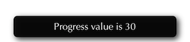
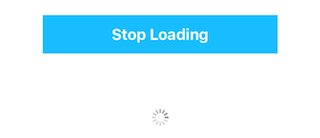
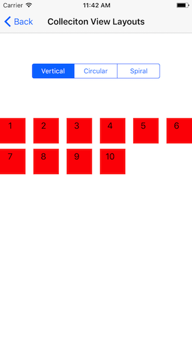
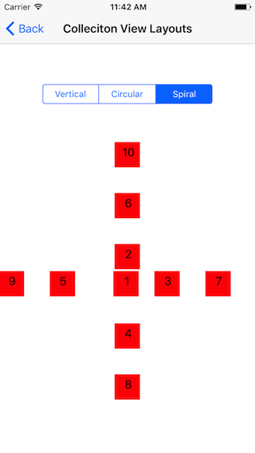

# swift-custom-ui-elements
Custom UI elements written for convenience

The following components are to be developed in UI for swift

* Rounded and corner type button
* Progress view circle
* Custom progress view bar
* Range selection slider 
* Toast message UI
* Custom collection views
	* Vertical
	* Circular
	* Spiral
* UIImage with circular and squared
* Radiant background view
* Loading indicator as an extension to the viewController

To integrate swift-custom-ui-elements into your Xcode project manually
add InnoUI module to your project.

```swift
import InnoUI
```

### Rounded and corner type button 
#### Description
With `InnoButton`, you can directly give rounded corners to UIButton by subclassing it.


#### Usage
Add an UIbutton IBOutlet from IB or can do programmatically by subclassing `InnoButton`.    
```swift
@IBOutlet weak var showButton: InnoButton! 
showButton.cornerRadius = 20
```
### Progress view circle
#### Description
`InnoProgressViewCircle` is a subclass of uiview shows progress in circle. Higlighted color shows the progress value. With this view, it becomes easy to use in any app for showing progress view in circle. Can customize the properties like
* Progress value
* Width of circle
* Higlighted progress color
* Default color of circle.
* Title for progress inside circle
* Shows progress value inside circle 


#### Usage
Add an uiview IBoutlet from IB or can do by programmatically create a uiview subclassing `InnoProgressViewCircle`.  
```swift
@IBOutlet weak var customProgressView: InnoProgressViewCircle!
```
Progress value range is 0.0 to 1.0 cgfloat value. Here below progress value is converted to range 1-100. You can use any range as per your requirements, by converting properly. In this app, on click of `Show Progress`button `showProgressButtonAction` changes progress value. Text from `progressValTextFld` is taken to show the progress 
```swift
customProgressView.setNeedsDisplay()
customProgressView.progress = CGFloat(Float(progressValTextFld.text!)!)/100
```
For customizing the progress circle title and lable, can do programmatically or can directly hide/show from IB also. Can hide or show title & label for progress circle as shown below.
```swift
@IBAction func switchStateChanged(_ sender: UISwitch) {
customProgressView.setNeedsDisplay()
if sender.isOn {
customProgressView.showTitle = true
} else {
customProgressView.showTitle = false
}
}
```
### Custom progress view bar

#### Description
`InnoProgressViewBar` is a subclass of uiview shows progress in bar. Higlighted color shows the progress value. Custom progress bar can customize the properties like
* Progress value
* Bar corner radius
* Higlighted progress bar color
* Default color of bar.
* Height and width (same as uiview)


#### Usage
Using this progress bar is very simple by adding an uiview IBoutlet from IB or can do programmatically create a uiview by subclassing `InnoProgressViewBar`. 

```swift
@IBOutlet weak var progressBarView: InnoProgressViewBar!
```

Progress bar value range is 1 to 100 cgfloat value. In this app, on click of `Show Progress` button `showProgressButtonAction` changes progress value. Text from `progressValTextFld` is taken to show the progress bar.

```swift
progressBarView.progressValue = CGFloat(Float(progressValTextFld.text!)!)
```

### Range selection slider
#### Description
`InnoRangeSelectionSlider` is a range selector control. It is used as a range selector. Highlighted color shows the selected range. InnoRangeSelectionSlider can customize properties like
* Minimum value - It sets the minimum value that slider can move 
* Maximum value - It sets the maximum value that slider can move
* Lower value - It should be in between/equal Minimum and maximum values and less than higher value 
* Higher value - It should be in between/equal Minimum and maximum values and greater than lower value
* Track tint color 
* Track Highlighting color
* Indicator tint color
* Curvaceousness - Defines the shape for indicator. It may be a circle or a square with corner radius. Values- 0.0 to 1.0


#### Usage
Add an uiview IBoutlet from IB or can do by programmatically create a uiview by subclassing `InnoRangeSelectionSlider`.  
```swift
@IBOutlet weak var rangeSlider: InnoRangeSelectionSlider!
```
Can change the properties of `InnoRangeSelectionSlider` in IB directly to suit your requirements. For reading the values from Range selection slider, give valueChanged IBAction for it.
```swift
@IBAction func innoRangeSelectionSliderValueChanged(_ sender: Any) {
self.getRangeSelectionText()
}
```
Read the values from rangeSlider as shown below.
```swift
func getRangeSelectionText() {
let lowVal = Int(rangeSlider.lowerValue)
let highVal = Int(rangeSlider.upperValue)
self.selectedValLbl.text = "Selected Range: \(lowVal) to \(highVal)"
}
```
### Toast message UI
#### Description
Toast message can be used to display information for the short period of time. A toast contains message to be displayed quickly and disappears after sometime. `UIView+InnoToastMessageUI` is an extension of UIView. Include this file in your project to get toast message.

#### Usage
To show toast message call `makeToast` on view OR window as per your requirements. 
```swift
view.makeToast(message: "Progress value is \(progressValTextFld.text!)")
```
OR get the UIWindow reference to show the toast in App. 
```swift
var currentWindow: UIWindow?
currentWindow = UIApplication.shared.keyWindow

currentWindow!.makeToast(message:
"Progress value is \(progressValTextFld.text!)"
)
```
### UIImage with circular and squared
#### Description
`UIImageView+InnoCircularImage` is an extension of UIImageView. With this extension you can make a UIImageView as circular. 
NOTE: The UIImageView width should be equal to UIImageView height. 
`UIImage+InnoSquareImg` is an extension of UIImage. With this you can draw an image as square shape irrespective of actaul image size. 
NOTE: To check the image as square, 'Content Mode' of UIImageView should be 'Aspect Fit'.
#### Usage
##### Circular
Create an IBOutlet for UIImageView. Call the extension method 'cropImageCircular' on that UIImageView.
```swift
@IBOutlet weak var circularImage: UIImageView!
// In viewDidLoad() 
circularImage.cropImageCircular()
```
##### Squared
Create an IBOutlet for UIImageView. Call the extension method 'cropImageSquared' to get square image on UIImage. Then give this image as the UIImage for UIImageView. 
```swift
@IBOutlet weak var squareImge: UIImageView!
// In viewDidLoad()
let profilImg = UIImage(named: "profileImg")
let sqrImg = profilImg?.cropImageSquared()
squareImge.image = sqrImg   
```
### Radiant background view
#### Description
Radiant background view can be used to set two colors as background color for view. `InnoRadiantBackground` is a subclass of UIView.


#### Usage
Add an uiview IBoutlet from IB or can do by programetically create a uiview subclassing `InnoRadiantBackground`.  
```swift
@IBOutlet weak var radiantView: InnoRadiantBackground!
```
You can change color1 and color2 values as below as per your requirements
```swift
radiantView.color1 = UIColor.yellow
radiantView.color2 = UIColor.blue
```
### Rounded buttons with transparent backgrounds.
#### Description
`UIButton+InnoDesignButton` is an extension of UIButton. With this extension you can make a button as rounded with transparent backgrounds. It has features like: Onhighlighting, button background color changes to the border/Text color and Text color changes to button normal background color.

#### Usage
```swift
@IBOutlet weak var designButton: UIButton!
designButton.setUpInnoDesign()
```
### Loading indicator as an extension to the viewController
#### Description
`UIViewController+InnoLoadingIndicator` is an extension of UIViewController. With this extension you can directly call start and stop of loading indicator as per requirement. Features are:
* Simple loading indicator.

* Loading indicator with customizable title for it.

#### Usage
* Simple Loading Indicator
Starting/animating simple loading as shown below. Can customize UIActivityIndicatorViewStyle and location of loading indicator on screen.
```swift
self.startLoadingIndicator(style: UIActivityIndicatorViewStyle.gray, location:view.center)
```
Stop simple loading as shown below.
```swift
self.stopLoadingIndicator()
```
* Loading indicator with customizable title
Starting/animating loading indicator view as below. Customize title for it(optional). 
```swift
self.startLoadingView(loadTitle: "Hello loading..")
```
Stop Loading indicator view.
```swift
self.stopLoadingView()
```
NOTE: For using this indicator as an extension to your viewcontroller, make sure that no other subviews in your viewcontroller should not have an tag value as 999990 and 999991.

### Customization of Loaders
#### Description
`CustomLoadingIndicator` is a subclass of UIView, used as a custom indicator. Can customize the image for the loading indicator. Can change the image of indicator as per your requirements.

#### Usage
Create an object for CustomLoadingIndicator with an image to load, then add as a subview to main view.
```swift
/// Custom indicator object
lazy fileprivate var customIndicator: CustomLoadingIndicator = {
/// Image of loading indicator
let image: UIImage = UIImage(named: "ColorSpinner")!
return CustomLoadingIndicator(innoImage: image)
}()
```
```swift
// In viewdidload
self.view.addSubview(customIndicator)

/// CGpoint for loading indicator
let firstPoint = CGPoint(x:firstButton.frame.origin.x+firstButton.frame.size.width/2, y:firstButton.frame.origin.y+firstButton.frame.size.height+80)
customIndicator.center = firstPoint
```
To start animating custom indicator
```swift
customIndicator.startCustomLoading() //Starts loading
```
To stop animating custom indicator
```swift
customIndicator.stopCustomLoading() //Stops loading
```
### Check Box
#### Description
`InnoCheckBoxButton` is a subclass of UIButton, used as check box.

#### Usage
Add an UIButton IBoutlet from IB or can do by programmatically create a UIButton by subclassing `InnoCheckBoxButton`.  
```swift
@IBOutlet weak var checkBoxButton: InnoCheckBoxButton!
```
Create IBAction for this button. Then `isChecked` property is used to show check box selection.
```swift
@IBAction func checkBoxClickAction(_ sender: Any) {
if checkBoxButton.isChecked {
checkBoxButton.isChecked = false
} else {
checkBoxButton.isChecked = true
}
}
```
### Custom collection views
#### Description
Custom collection view layouts are as follows.
* Vertical - This layout is a default layout for UIcollectionview i.e UICollectionViewFlowLayout. It has a scrolling direction as vertical or horizontal, can adjust based on requirements.
 
* Circular - This is a custom layout for collection view. `InnoCircularLayout` is a subclass of `UICollectionViewLayout`.By using this layout you can get the collection view items in circular shape.
 
* Spiral - This is a custom collection view layout. `InnoSpiralLayout` is a subclass of `UICollectionViewLayout`. By using this layout you can get spiral shape for collection view items.
 
#### Usage
Add an UICollectionview IBOutlet in xib or programmatically. To get a diffrent layout for collectionview set layouts as shown below.
* Vertical - To get vertical scrolling layout for collection view, set layout as `UICollectionViewFlowLayout` and set scrolling direction to `Vertical`. This can be done directly in xib or programmatically as shown below.
```swift
let layout = UICollectionViewFlowLayout()
layout.scrollDirection = .vertical
custCollectionView.setCollectionViewLayout(layout, animated: false)
custCollectionView.reloadData()
```
* Circular - For circular layout collection view, `InnoCircularLayout` is used. Import `InnoUI` module in viewcontroller and include `InnoCircularLayout` class in your project. 
```swift
custCollectionView.setCollectionViewLayout(InnoCircularLayout(), animated: false)
custCollectionView.reloadData()
```
* Spiral - For spiral layout collection view, `InnoSpiralLayout` is used. Import `InnoUI` module in viewcontroller and include `InnoSpiralLayout` class in your project. 
```swift
custCollectionView.setCollectionViewLayout(InnoSpiralLayout(), animated: false)
custCollectionView.reloadData()
```
